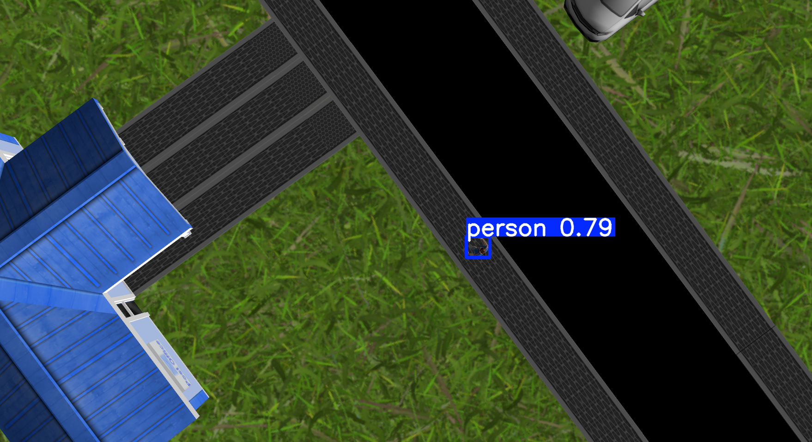
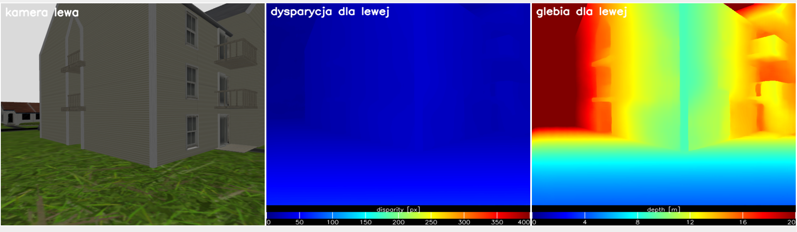
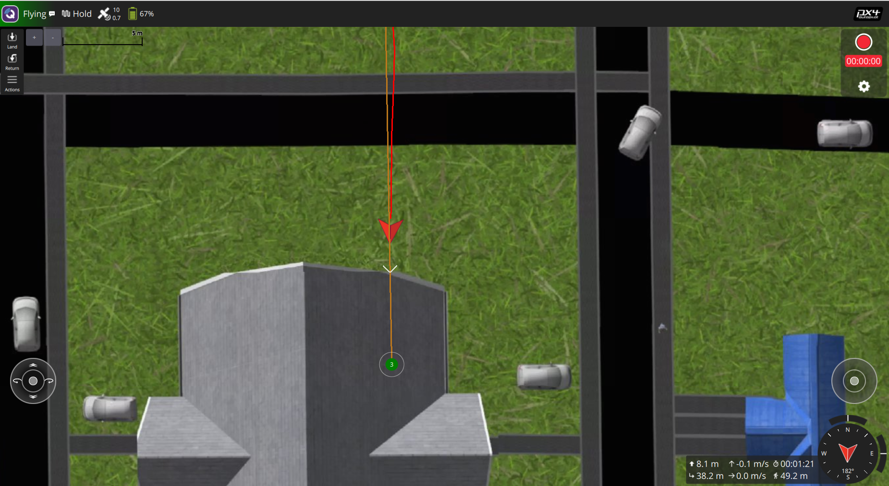
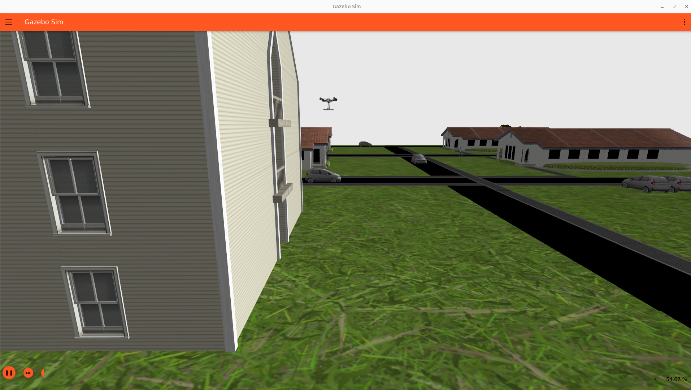

# UAV simulation
Simulation of UAV in Gazebo with ROS2, PX4 Autopilot and QGroundControl.

## Requirements
- **Docker** (Docker CLI recommended)
  - Add your user to the Docker group to grant the necessary permissions; otherwise, you must prefix commands with sudo.
  
- **Visual Studio Code** with the following extensions:
  - [Docker](https://marketplace.visualstudio.com/items?itemName=ms-azuretools.vscode-docker)
  - [Dev Containers](https://marketplace.visualstudio.com/items?itemName=ms-vscode-remote.remote-containers)
 
- **GPU support requires**
  - [nvidia-container-toolkit](https://docs.nvidia.com/datacenter/cloud-native/container-toolkit/latest/install-guide.html)

## Preparing the environment
 
### Docker build
```bash
docker build -t dron_sim:latest . --build-arg USER_UID=$(id -u)
```

To set DOCKER_GPU_PARAM environment variable, run:
```bash
source ./scripts/set_GPU_param.sh
```


### Python Virtual Environment Setup (venv)
  1. go to workspace folder:
  ```bash
  cd workspace
  ```

  2. go to workspace folder:
  ```bash
  cd workspace
  ```

  3. Open VS code in the folder:
  ```bash
  code .
  ```

  4. Build container with .devcontainer:

  Use shortcut:
  ```bash
  Ctrl + Shift + P
  ```
  Then choose option:
  ```bash
  Dev Containers: Rebuild Container
  ```
  
  5. Change directory:
 
  ```bash
  cd ../venv
  ```
 
  6.  Create a virtual environment

  ```bash
  python3 -m venv hitnet_gpu
  ```

  7. Activate the virtual environment:
     
  ```bash
  source hitnet_gpu/bin/activate
  ```
  After activation, your shell prompt should show:
  ```bash
  (hitnet_gpu)
  ```

  8. Installing dependencies:
  ```bash
  pip install -r requirements.txt
  ```

  **(good practice) Using venv inside Docker / Devcontainer**
  
  When working in Docker or a VS Code devcontainer, it is recommended to keep the virtual environment outside the workspace directory to avoid build tools (e.g. colcon) scanning site-packages.

## Simulation Execution Guide
This section describes how to launch the simulation in Gazebo, visualize sensor data and execute the object detection and obstacle avoiding.


**1. Launch Gazebo Simulation**

Open a terminal and execute the following commands:
```bash
source install/setup.bash
ros2 launch uav_bringup uav.launch.py
```
This command starts the TurtleBot4 Lite model in the `office` world with the specified initial position.

<p align="center">
  
  <br>
  <em>Figure 1: Gazebo simulator view</em>
</p>

<p align="center">
  
  <br>
  <em>Figure 2: QGroundControl tool view</em>
</p>

**launch vision system**

```bash
cd ~/ws
source ../venv/hitnet_gpu/bin/activate
source install/setup.bash
cd src/uav_vision
ros2 launch uav_vision uav_vision_all.launch.py
```

<p align="center">
  
  <br>
  <em>Figure 3: Screenshot showing people detection</em>
</p>

<p align="center">
  
  <br>
  <em>Figure 4: Screenshot showing disparity and depth estimation based on stereo vision cameras</em>
</p>

<p align="center">
  
  <br>
  <em>Figure 5: Screenshot showing the UAV stopping by entering hold mode based on a depth estimation reading of less than 5 meters</em>
</p>

<p align="center">
  
  <br>
  <em>Figure 6: Screenshot showing the UAV stopping in the Gazebo simulator</em>
</p>


## Gazebo World Editing — Practical Notes

**Saving the World File**

When adding new objects to the world, it is recommended to save the world as a new file.
Gazebo may sometimes break relative paths and dependencies when modifying existing worlds.

**Downloading Gazebo Models**

Gazebo models can be downloaded from the official model repository:

`https://app.gazebosim.org/dashboard`

Relevant sections include:
- Model plugins
- Joint control
- System plugins (Ignition / Gazebo Sim)

**Editing the World File Locally**

It is recommended to edit the world file locally by modifying the .sdf file directly, for example:

`worlds/world.sdf`

This provides better control over object definitions and dependencies than editing solely through the GUI.

**Running Gazebo with a Specific World**

To launch Gazebo with a selected world file:

`ign gazebo office.sdf`

Replace `office.sdf` with the path to your desired world file if it is not in the current directory.


### Throubleshoting
If you will encounter a problem with "xcb" (GUI applications won't open) just run `xhost +local:docker` on your host machine.


sudo apt install libignition-gazebo6-plugins

### Useful statement

colcon build --symlink-install
source install/setup.bash

## Acknowledgement
- https://github.com/PX4/PX4-Autopilot
- https://github.com/ultralytics/ultralytics
- https://www.ros.org/
- https://gazebosim.org/

Enable async CUDA allocator
export TF_GPU_ALLOCATOR=cuda_malloc_async
