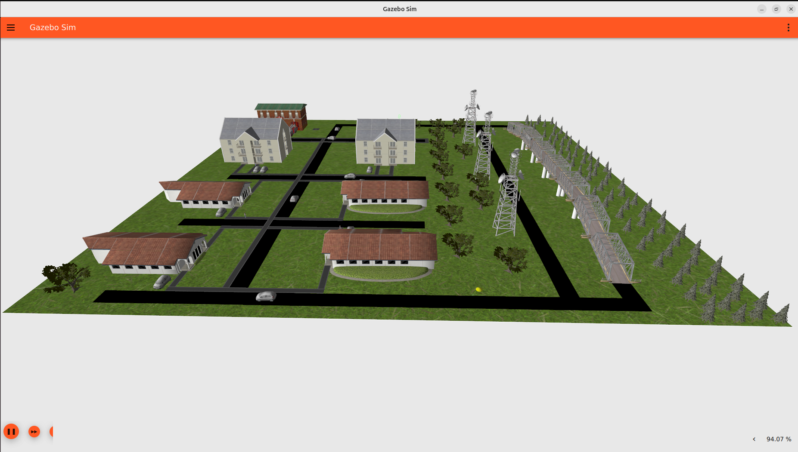
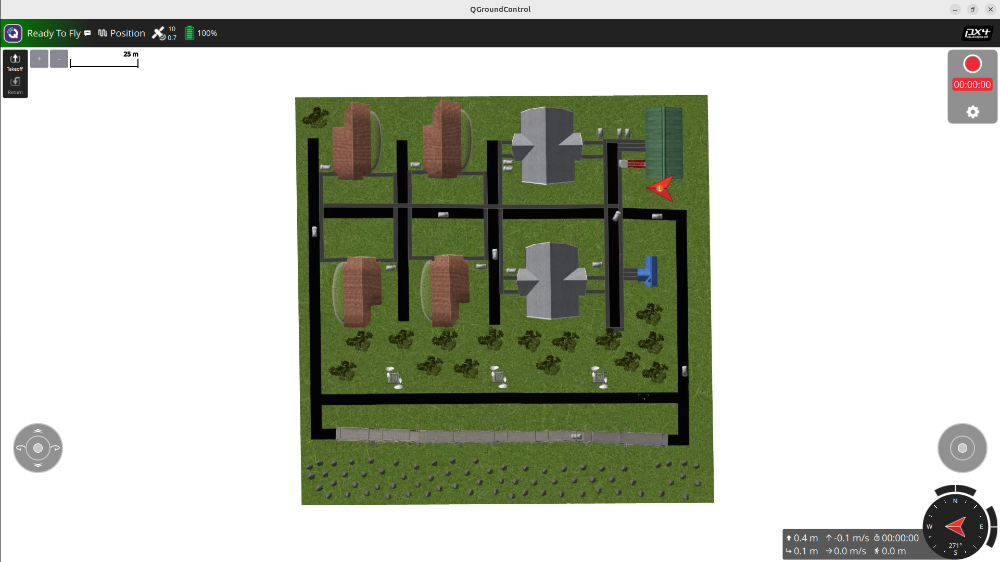

# dron_sim
Simulation of UAV in Gazebo with ROS2, PX4 Autopilot and QGroundControl.

### Requirements
- **Docker** (Docker CLI recommended)
  - Add your user to the Docker group to grant the necessary permissions; otherwise, you must prefix commands with sudo.
  
- **Visual Studio Code** (recommended) with the following extensions:
  - [Docker](https://marketplace.visualstudio.com/items?itemName=ms-azuretools.vscode-docker)
  - [Dev Containers](https://marketplace.visualstudio.com/items?itemName=ms-vscode-remote.remote-containers)

  - **Gazebo assets** saved to /home/"host"/.gz/fuel/fuel.gazebosim.org/openrobotics/models/
  "host" is your nickname

  
### Docker build
```bash
docker build -t dron_sim:latest . --build-arg USER_UID=$(id -u)
```

To set DOCKER_GPU_PARAM environment variable, run:
```bash
source ./scripts/set_GPU_param.sh
```

### Docker run
Running docker with GPU support requires [nvidia-container-toolkit](https://docs.nvidia.com/datacenter/cloud-native/container-toolkit/latest/install-guide.html), but if you don't have NVIDIA GPU, you can remove the `--gpus=all` flag and run this container only with CPU.

```bash
docker run -it --rm \
  --name dron_sim \
  --network=host \
  --ipc=host \
  --gpus=all \
  --privileged \
  --device=/dev/dri \
  --device=/dev/dri/renderD128 \
  --device=/dev/dri/card0 \
  --device=/dev/dri/card1 \
  --group-add=video \
  -e DISPLAY=$DISPLAY \
  -e XDG_RUNTIME_DIR=/tmp/xdg-runtime-dir-1000 \
  -e ROS_DOMAIN_ID=0 \
  -e NVIDIA_VISIBLE_DEVICES=all \
  -e NVIDIA_DRIVER_CAPABILITIES=all \
  -e GZ_SIM_RESOURCE_PATH=$GZ_SIM_RESOURCE_PATH:/home/karol/ws/src/uav_sim/models \
  -v /tmp/.X11-unix:/tmp/.X11-unix \
  -v /home/karol/.gz:/home/karol/.gz \
  -v "$(pwd)/.qgc-config:/home/karol/.config/QGroundControl:rw" \
  -v hitnet_venv:/home/karol/venv \
  -v "$(pwd):/home/karol/ws" \
  -w /home/karol/ws \
  --user karol \
  dron_sim \
  bash

```

### Run for development
Running docker with GPU support requires [nvidia-container-toolkit](https://docs.nvidia.com/datacenter/cloud-native/container-toolkit/latest/install-guide.html), but if you don't have NVIDIA GPU, you can remove the `--gpus=all` flag in `devcontainer.json` and run this container only with CPU.

Click `Ctrl+Shift+P` and select `Dev Containers: Rebuild and Reopen in Container`. 
This will open the repository in the container and you can start developing.

To rebuild workspace use shortcut `Ctrl+Shift+B` in the vscode.

**1. Launch Gazebo Simulation**

Open a terminal and execute the following commands:
```bash
colcon build
source install/setup.bash
ros2 launch uav_bringup uav.launch.py
```
This command starts the TurtleBot4 Lite model in the `office` world with the specified initial position.

<p align="center">
  
  <br>
  <em>Figure 1: Gazebo simulator view</em>
</p>

<p align="center">
  
  <br>
  <em>Figure 1: QGroundControl tool view</em>
</p>

**launch vision system**

```bash
cd ~/ws
source ../venv/hitnet_gpu/bin/activate
source install/setup.bash
cd src/uav_vision
ros2 launch uav_vision uav_vision_all.launch.py
```

**2. uav_camera_det.py**

```bash
cd ~/ws
source install/setup.bash
python3 src/uav_vision/uav_camera_det.py
```

**3. disparity.py**

```bash
cd ~/ws
source ../venv/hitnet_gpu/bin/activate
source install/setup.bash
cd src/uav_vision
python3 disparity.py
```

**4. depth_stop_node.py**

```bash
cd ~/ws
source install/setup.bash
python3 src/uav_vision/depth_stop_node.py
```

**5. depth_stop_node.py**

```bash
cd ~/ws
source install/setup.bash
python3 src/uav_vision/stop_controller_node.py
```

-----
-----
-----
-----
-----

### Gazebo World Editing — Practical Notes

**Saving the World File**

When adding new objects to the world, it is recommended to save the world as a new file.
Gazebo may sometimes break relative paths and dependencies when modifying existing worlds.

**Downloading Gazebo Models**

Gazebo models can be downloaded from the official model repository:

`https://app.gazebosim.org/dashboard`

Relevant sections include:
- Model plugins
- Joint control
- System plugins (Ignition / Gazebo Sim)

**Editing the World File Locally**

It is recommended to edit the world file locally by modifying the .sdf file directly, for example:

`worlds/world.sdf`

This provides better control over object definitions and dependencies than editing solely through the GUI.

**Running Gazebo with a Specific World**

To launch Gazebo with a selected world file:

`ign gazebo office.sdf`

Replace `office.sdf` with the path to your desired world file if it is not in the current directory.


### Throubleshoting
If you will encounter a problem with "xcb" (GUI applications won't open) just run `xhost +local:docker` on your host machine.


sudo apt install libignition-gazebo6-plugins

### Useful statement

colcon build --symlink-install
source install/setup.bash

## Acknowledgement
- https://github.com/PX4/PX4-Autopilot
- https://github.com/ultralytics/ultralytics
- https://www.ros.org/
- https://gazebosim.org/

Enable async CUDA allocator
export TF_GPU_ALLOCATOR=cuda_malloc_async
